# 📚 The Ultimate Guide to Number Guessing Game

<div align="center">

# 🎓 **COMPLETE BEGINNER'S GUIDE** 🎓


### 🌈 **From Installation to Mastery - Everything You Need!** 🌈

</div>

---
## 🎯 What is This Game?

<div style="background: linear-gradient(135deg, #667eea 0%, #764ba2 100%); padding: 20px; border-radius: 10px; color: white;">

### 🎲 **The Concept**

The Number Guessing Game is a classic programming exercise that has been transformed into an engaging, feature-rich console game! The computer thinks of a random number, and you have to guess it using hints.

### 🎯 **The Goal**

Guess the secret number in as few attempts as possible! The game tracks your best score and challenges you to beat it.

</div>

---

## 🧠 Understanding the Code

### 📂 **File Structure**

```
number-guessing-game/
│
├── 📄 game.c           # Main game source code
├── 📖 README.md        # Project documentation
├── 📚 GUIDE.md         # This guide!
├── 🛠️ Makefile        # Build automation
├── 📜 LICENSE          # MIT License
└── 🚫 .gitignore      # Git ignore file
```

### 🔤 **Key Programming Concepts Used**

|Concept|🎯 Purpose|📍 Where in Code|
|:--|:--|:--|
|**🔄 Loops**|Repeat game & guessing|`do-while` loops|
|**❓ Conditionals**|Check guesses & difficulty|`if-else` statements|
|**🎲 Random Numbers**|Generate secret number|`rand()` & `srand()`|
|**📥 Input/Output**|User interaction|`printf()` & `scanf()`|
|**📊 Variables**|Store game state|`int`, `char` types|
|**🛡️ Input Validation**|Handle bad input|Error checking|

---

## 🚀 Getting Started

### 🖥️ **Step 1: Install a C Compiler**

<details> <summary><b>💠 Windows Users (Click to Expand)</b></summary>

#### Option A: MinGW (Recommended)

1. Download MinGW from [mingw-w64.org](https://www.mingw-w64.org/)
2. Run installer and select "gcc" component
3. Add MinGW to PATH:
    - Right-click "My Computer" → Properties
    - Advanced System Settings → Environment Variables
    - Add `C:\MinGW\bin` to PATH
4. Test in Command Prompt: `gcc --version`

#### Option B: Visual Studio

1. Download Visual Studio Community (free)
2. Install "Desktop development with C++" workload
3. Use Developer Command Prompt

</details> <details> <summary><b>🐧 Linux Users (Click to Expand)</b></summary>

#### Ubuntu/Debian:

```bash
sudo apt update
sudo apt install build-essential
gcc --version  # Verify installation
```

#### Fedora/RHEL:

```bash
sudo dnf install gcc
gcc --version
```

#### Arch Linux:

```bash
sudo pacman -S gcc
gcc --version
```

</details> <details> <summary><b>🍎 macOS Users (Click to Expand)</b></summary>

#### Install Xcode Command Line Tools:

```bash
xcode-select --install
# Follow the prompt
gcc --version  # Verify
```

#### Alternative: Homebrew

```bash
/bin/bash -c "$(curl -fsSL https://raw.githubusercontent.com/Homebrew/install/HEAD/install.sh)"
brew install gcc
```

</details>

### 📥 **Step 2: Download the Game**

```bash
# Method 1: Git Clone (Recommended)
git clone https://github.com/shiwansh-bind/number-guessing-game.git
cd number-guessing-game

# Method 2: Download ZIP
# 1. Go to GitHub repo
# 2. Click "Code" → "Download ZIP"
# 3. Extract the ZIP file
# 4. Open terminal in that folder
```

### 🔨 **Step 3: Compile the Game**

```bash
# Basic compilation
gcc -o game game.c

# With all warnings (recommended for learning)
gcc -Wall -o game game.c

# Optimized for performance
gcc -O2 -o game game.c
```

### ▶️ **Step 4: Run the Game**

```bash
# Linux/macOS
./game

# Windows
game.exe
# or
./game
```

---

## 🎮 Playing Your First Game

### 🎬 **Game Flow Visualization**

```mermaid
graph TD
    A[🎮 Start Game] --> B[📊 Choose Difficulty]
    B --> C[🎲 Computer Picks Number]
    C --> D[💭 Make a Guess]
    D --> E{🎯 Correct?}
    E -->|No| F[📍 Get Hint]
    F --> D
    E -->|Yes| G[🏆 Show Score]
    G --> H{🔄 Play Again?}
    H -->|Yes| B
    H -->|No| I[👋 Exit]
```



### 🎯 **Your First Playthrough**

<div style="background: #f0f0f0; padding: 15px; border-radius: 8px; border-left: 4px solid #4CAF50;">

#### 🟢 **Example: Easy Mode (1-50)**

```
WELCOME TO THE NUMBER GUESSING GAME
Choose difficulty level:
1. Easy (1-50)
> 1

enter the secret code: 25
Too low! Try a much bigger number.

enter the secret code: 40
Slightly high! Try going lower.

enter the secret code: 35
Very close, but still a bit high! Go a little lower.

enter the secret code: 33
Woohoo! Correct!
New high score! You guessed it in 4 tries!
```

</div>

---

## 🏆 Mastering the Game

### 🧮 **Optimal Strategy: Binary Search**

<div style="background: linear-gradient(135deg, #f093fb 0%, #f5576c 100%); padding: 20px; border-radius: 10px; color: white;">

#### 🎯 **The Mathematical Approach**

For a range of 1-100, the optimal strategy guarantees finding the number in at most 7 guesses!

**How it works:**

1. Start with middle number (50)
2. If too high, guess middle of lower half (25)
3. If too low, guess middle of upper half (75)
4. Repeat until found!

</div>

### 📊 **Difficulty Analysis**

|Level|Range|Max Guesses (Binary Search)|Random Guessing (Average)|
|:-:|:-:|:-:|:-:|
|Easy|50|6|25|
|Medium|100|7|50|
|Hard|500|9|250|
|Nightmare|1000|10|500|
|Ultra|10000|14|5000|

### 🎮 **Pro Tips & Tricks**

<table> <tr> <td>

#### 🎯 **Gameplay Tips**

- 🧠 Always start with the middle number
- 📝 Keep track of your guesses mentally
- 🎲 Use the hint proximity to narrow down
- ⚡ Type quickly but accurately
- 🔄 Practice makes perfect!

</td> <td>

#### 🏅 **High Score Tips**

- 📊 Use binary search method
- 🎯 Pay attention to "very close" hints
- 💡 Remember previous game patterns
- 🚀 Stay calm under pressure
- 🏆 Challenge friends to beat your score!

</td> </tr> </table>

---

## 💻 Code Breakdown

### 🔍 **Line-by-Line Explanation**

<details> <summary><b>📦 Headers & Setup (Click to Expand)</b></summary>

```c
#include <stdio.h>    // For printf() and scanf()
#include <stdlib.h>   // For rand() and abs()
#include <time.h>     // For time() to seed random
```

**What do these do?**

- `stdio.h`: Allows input/output operations
- `stdlib.h`: Provides random number generation
- `time.h`: Gets current time for randomization

</details> <details> <summary><b>🎲 Random Number Generation (Click to Expand)</b></summary>

```c
srand(time(NULL));  // Seed the random generator
int secretnumber = rand() % maxNumber + 1;
```

**How it works:**

1. `time(NULL)` gets current time in seconds
2. `srand()` uses this to initialize random generator
3. `rand() % maxNumber` gives 0 to maxNumber-1
4. Adding 1 makes it 1 to maxNumber

</details> <details> <summary><b>🎯 Smart Hint System (Click to Expand)</b></summary>

```c
int diff = guess - secretnumber;

if (diff > 20)
    printf("Too high! Try a much smaller number\n");
else if (diff > 10)
    printf("Slightly high! Try going lower.\n");
else
    printf("Very close, but still a bit high!\n");
```

**The Logic:**

- Calculates difference between guess and secret
- Provides contextual hints based on proximity
- Helps player narrow down quickly

</details> <details> <summary><b>🏆 High Score System (Click to Expand)</b></summary>

```c
if (highscore == 0 || count < highscore) {
    highscore = count;
    printf("New high score! You guessed it in %d tries\n", highscore);
}
```

**Features:**

- Tracks best performance across games
- Updates when you beat previous record
- Motivates improvement

</details>

---

## 🔧 Customization Guide

### 🎨 **Easy Modifications**

<div style="background: #e8f5e9; padding: 15px; border-radius: 8px;">

#### 1️⃣ **Add More Difficulty Levels**

```c
else if (choice == 6) {
    printf("You Chose IMPOSSIBLE (1-100000)!\n");
    maxNumber = 100000;
}
```

#### 2️⃣ **Change Hint Messages**

```c
if (diff > 50)
    printf("🔥 You're burning up! Way too high!\n");
```

#### 3️⃣ **Add Sound Effects** (Windows)

```c
#include <windows.h>
Beep(1000, 200);  // Frequency, Duration
```

#### 4️⃣ **Color Output** (ANSI)

```c
printf("\033[1;32mCorrect!\033[0m\n");  // Green text
printf("\033[1;31mToo high!\033[0m\n"); // Red text
```

</div>

### 🚀 **Advanced Modifications**

- 📊 Add a leaderboard system
- 💾 Save high scores to file
- 🎮 Add multiplayer mode
- ⏱️ Add time-based challenges
- 🏅 Add achievements system
- 🎨 Create GUI version

---

## ❓ FAQ

<details> <summary><b>❓ Why does my game always pick the same number?</b></summary>

You might be missing the `srand(time(NULL));` line. This seeds the random generator with current time, ensuring different numbers each run.

</details> <details> <summary><b>❓ Can I play this on my phone?</b></summary>

Not directly, but you can:

- Use online C compilers (repl.it, ideone)
- Install terminal apps with GCC support
- Port the code to a mobile-friendly language

</details> <details> <summary><b>❓ How can I make the game harder?</b></summary>

- Increase the number range
- Add a guess limit
- Add a timer
- Remove some hints
- Add negative numbers

</details> <details> <summary><b>❓ What's the mathematical formula for optimal guesses?</b></summary>

Optimal guesses = ⌈log₂(n)⌉ where n is the range size. For 1-100: ⌈log₂(100)⌉ = 7 guesses

</details>

---

## 🐛 Troubleshooting

### 🔴 **Common Issues & Solutions**

|Problem|🔧 Solution|
|:--|:--|
|**"gcc not found"**|Install GCC compiler (see Getting Started)|
|**Game crashes on input**|Check for buffer overflow, use input validation|
|**Same number every time**|Add `srand(time(NULL));` at start|
|**Can't compile on Windows**|Use MinGW or WSL|
|**Permission denied**|Use `chmod +x game` on Linux/Mac|
|**Weird characters in output**|Terminal doesn't support ANSI colors|

---

## 🎉 Congratulations!

<div align="center">

### 🌟 **You're Now a Number Guessing Game Expert!** 🌟

You've learned:

- ✅ How to compile and run C programs
- ✅ Understanding game logic and flow
- ✅ Optimal strategies for winning
- ✅ How to modify and enhance the code
- ✅ Troubleshooting common issues

### 🚀 **What's Next?**

1. **🏆 Beat all difficulty levels**
2. **💻 Customize the code**
3. **🌟 Share with friends**
4. **⭐ Star the repository**
5. **🔧 Contribute improvements**

 

### 💬 **Need Help?**

[Open an Issue](https://github.com/shiwansh-bind/number-guessing-game/issues) • [Join Discussion](https://github.com/shiwansh-bind/number-guessing-game/discussions)

</div>

---

<div align="center">

**Happy Gaming! 🎮**

</div>
